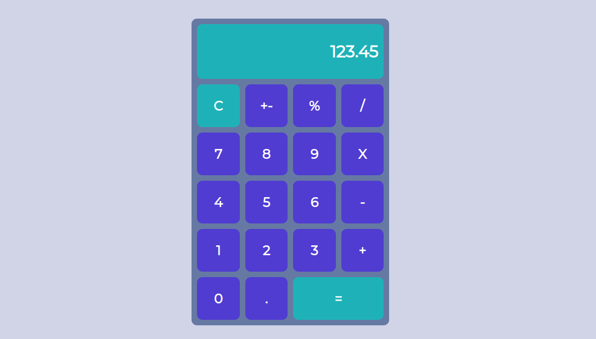

## calculator
This is a simple calculator app built with React. It supports the following operations:  
Addition (+)  
Subtraction (-)  
Multiplication (X)  
Division (/)  
Percent (%)  
Invert (+-)  
Clear (C)  
To use the calculator, simply enter your numbers and operators, and click the "=" button to calculate the result.

## Link and Screenshot  
[Go Live](https://calculator-deployed.netlify.app/)  

## Installation
Clone this repository:  
git clone https://github.com/bokhuuu/calculator.git  

Install the dependencies:  
npm install

Start the development server:  
npm run dev  
The calculator app will be available at http://localhost:5173.  

## Contributing
Contributions are welcome! Please feel free to open an issue or submit a pull request if you have any suggestions or improvements.  

## Additional Notes  
The calculator supports up to 16 digits of precision.  
The calculator will display a "can't divide with 0" error if you try to divide by zero.  
The calculator will clear all input and results if you click the "C" button.  

